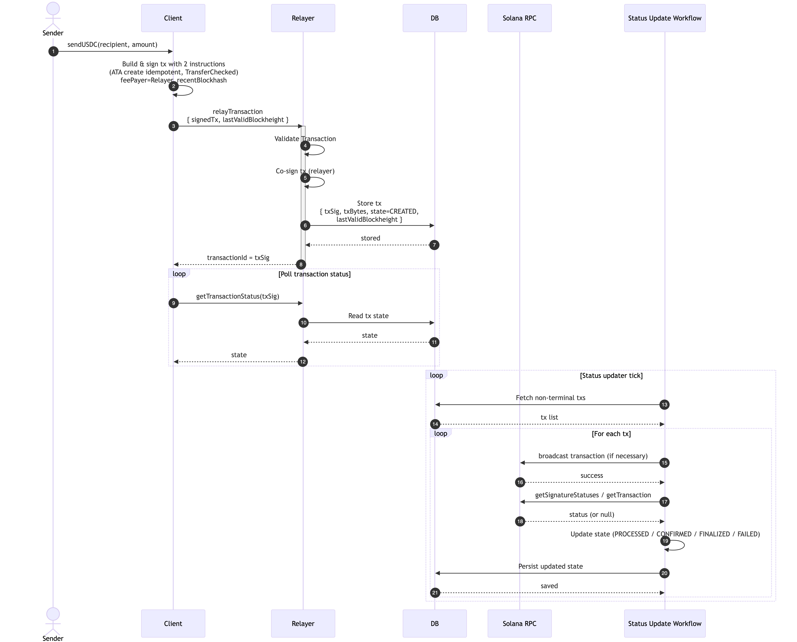

## Gasless USDC Remittance Transfer

This codebase is a sample implementation for gasless USDC transfers, which is useful for powering a remittance app built on Solana.

For the purposes of the demo:

- There is no database (all state is stored in-mem)
- The relayer "API" is just a function call.
- Functions to perform due diligence and send receipts are mocked out.

The app has a few components.

### The Client

It has a "transfer" function which takes, as input, the recipient address, and a USDC amount. It:

- Generates a transaction with two instructions
  - Idempotent creation of the recipient ATA (associated token account)
  - The transfer instruction between the two ATAs
- Sets the fee payer to the known relayer address.
- Signs the transaction and sends it to the relayTransaction API, along with the lastValidBlockHeight.
- When the relayer responds with the transactionId, it kicks off the pollTransactionStatus loop.

The "pollTransactionStatus" loop:

- periodically polls the relayer's getTransactionStatus API.
- updates the local state to reflect changes. We consider the CONFIRMED status success (which provides the user with quick feedback). For the purposes of the demo, it just logs.

### The Relayer

The relayer has two APIs.

The "relayTransaction" API:

- Performs a number of checks on the submitted transaction
  - ensures that there are two instructions in the transaction.
  - ensures the fee payer is correct.
  - ensures transaction has a recent blockhash
  - ensures no unexpected signers
  - for the second instruction:
    - ensures it is a TransferChecked instruction
    - ensures both sender and recipient are accounts in our DB (to protect us from gas freeloaders)
    - calls isCompliant on both sender and recipient to perform due diligence
    - ensures source ATA owner is sender
    - ensures destination ATA owner is recipient
    - ensures token is USDC
  - for the first instruction:
    - ensures it is a Token Account Create Idempotent instruction
    - ensures the target is the recipient ATA for USDC
  - ensures sender signature present
- Stores the transaction (keyed by transactionHash), if it is not already stored in the DB.
  - sets status = CREATED
  - includes lastValidBlockHeight
- returns the transactionId (transactionHash)

The "getTransactionStatus" API:

- Looks up the transaction in the DB, and returns the status.

### Status Update Workflow:

This component periodically gets all non-terminal transactions (transactions that are not in FINALIZED or FAILED state). For each one, it:

- calls getSignatureStatuses
  - if this returns null:
    - if isBlockhashValid (i.e. we can re-submit the transaction)
      - broadcast the transaction on-chain
      - if state is CREATED
        - update state to SUBMITTED
  - else:
    - confirms the transaction has failed before setting status.
      - calls getEpochInfo({ commitment: "finalized" }) // get the most recently finalized block
        - if getEpochInfo.blockHeight < lastValidBlockHeight, returns
      - calls getSignatureStatuses (with searchTransactionHistory = true)
        - If response is not null, returns
      - calls getTransaction
        - If response is not null, returns
      - sets state = FAILED
      - returns

- gets confirmationStatus from transaction
  - If status == “processed”
    - Set state = PROCESSED
  - If status == “confirmed”
    - Set state = CONFIRMED
  - If status == “finalized”
    - Call sendReceipt function
    - Set state = FINALIZED

## How To Run The Test

1. Install dependencies (if not already done):

   ```
   npm install
   ```

2. create a keypairs.json in the root of this repo with 3 keypairs:

   ```
   "sender": key
   "recipient": key
   relayer: key
   ```

3. Run the demo:

   ```
   npm start
   ```

4. Fund the accounts when prompted:

- Relayer - needs ~0.01 SOL for gas fees
- Sender - needs devnet USDC to transfer

Once funded, the demo will automatically:

- Create a gasless USDC transfer (half of sender's balance)
- Submit it via the relayer
- Poll until finalized
- Print a receipt

## Sequence Diagram

Here is a simplified diagram showing the flow:


